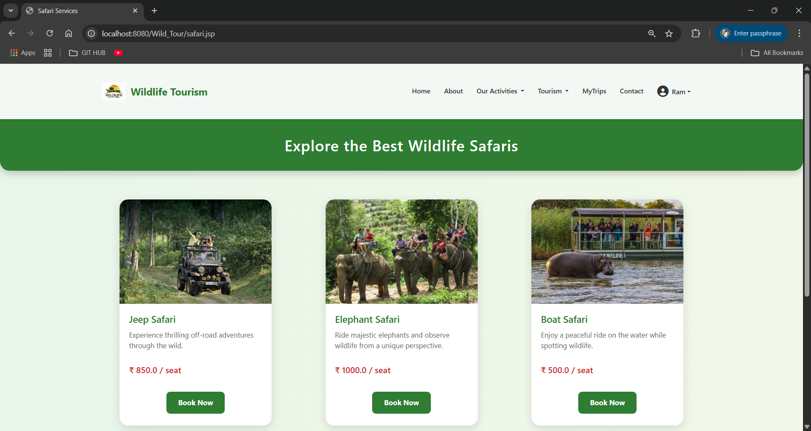
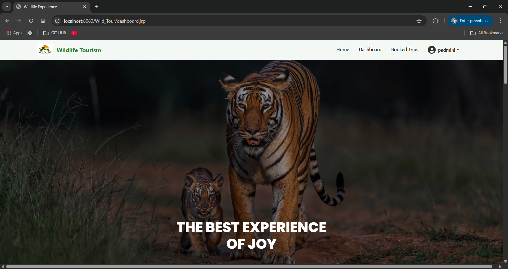
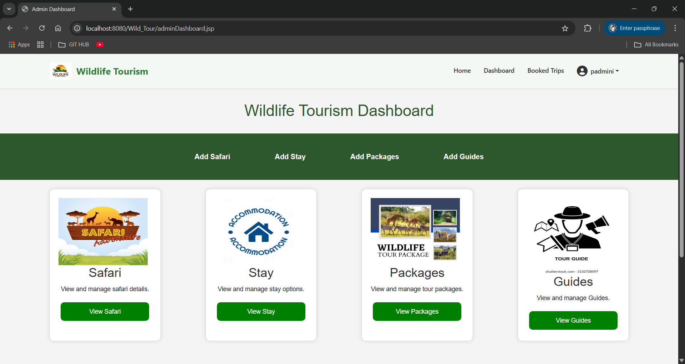
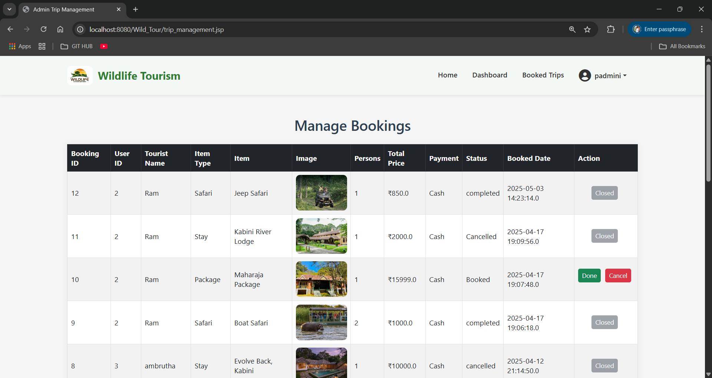

# Wild Life Tour Management

A comprehensive web-based platform designed to manage wildlife tours, customer bookings, tour packages, guides, safari plans, and accommodations. This system provides dedicated interfaces for both **users** and **administrators** and offers end-to-end management of wildlife tourism operations.

---

## Table of Contents
- [Overview](#overview)
- [Features](#features)
- [Tech Stack](#tech-stack)
- [System Architecture](#system-architecture)
- [Modules](#modules)
- [Database Design](#database-design)
- [DTO Documentation](#dto-documentation)
- [Servlet Documentation](#servlet-documentation)
- [Application Workflows](#application-workflows)
- [How to Run the Project](#how-to-run-the-project)
- [Folder Structure](#folder-structure)
- [Screenshots](#screenshots)
- [Future Enhancements](#future-enhancements)

---

## Overview

Wild Life Tour Management is a Java-based web application that streamlines wildlife tour booking and management. It enables customers to explore packages, safari plans, accommodations, and guides, while administrators manage bookings, update package information, and maintain system data.

This project is ideal for demonstrating skills in **Java Servlets, JSP, JDBC, MVC architecture, MySQL, and web development**.

---

## Features

### User Features
- User registration and login  
- Explore tour packages  
- Book wildlife tours  
- View and cancel bookings  
- Manage user profile  
- Forgot-password functionality  

### Admin Features
- Add/update/delete safari packages  
- Manage bookings (approve / reject)  
- Add/update stays and accommodation  
- Add/update tour guides  
- Monitor system activity  

---

## Tech Stack

### Backend
- Java  
- Java Servlets  
- JSP  
- JDBC  
- Maven  

### Frontend
- HTML  
- CSS  
- JSP pages  
- Basic JavaScript  

### Database
- MySQL  
- wildlife.sql included  

### Server
- Apache Tomcat  

---

## System Architecture

The system follows a **Model–View–Controller (MVC)** pattern:

- **DTO Layer:** Data carriers (User, Safari, Packages, Guide, Stay, etc.)
- **Servlet Layer:** Business logic and request processing
- **DAO Layer:** Database operations (via JDBC)
- **View Layer:** JSP pages for UI

---

## Modules

### 1. User Module
- Signup.jsp  
- Login.jsp  
- User dashboard  
- Bookings management  
- Profile update  

### 2. Admin Module
- Admin dashboard  
- Add/Edit/Delete Packages  
- Add/Edit/Delete Safari  
- Manage bookings  
- Manage guides & stays  

### 3. Booking Module
- Booking creation  
- Status tracking  
- Admin approval  
- Cancellation  

---

## Database Design

The database schema is stored in **wildlife.sql**.  
The key tables include:

- `user`  
- `packages`  
- `safari`  
- `stay`  
- `bookings`  
- `guides`  

Each table includes attributes like IDs, names, descriptions, price, availability, status, etc.

---

## DTO Documentation

### Key DTO Classes:
- `User.java`
- `Safari.java`
- `Packages.java`
- `Stay.java`
- `Bookings.java`
- `Guide.java`

Each DTO encapsulates fields, constructors, getters, and setters representing individual records from the respective database tables.

---

## Servlet Documentation

Here are the main servlets included in the project:

### **Authentication Servlets**
- `Login.java` – Validates user/admin login  
- `Signup.java` – Registers new user  
- `ForgotPassword.java` – Resets forgotten passwords  

### **Admin Action Servlets**
- `PackagesAction.java` – Create/update/delete tour packages  
- `SafariAction.java` – Manage safari plans  
- `StayAction.java` – Manage accommodations  
- `GuideAction.java` – Add/update guides  
- `UpdateBookingStatus.java` – Approve/reject user bookings  

### **User Action Servlets**
- `Bookings.java` – User booking creation  
- `CancelBooking.java` – Booking cancellation  
- `Update.java` – Update user profile  

---

## Application Workflows

### User Workflow
1. User signs up  
2. Logs in  
3. Views packages and safari plans  
4. Books a wildlife tour  
5. Admin reviews and updates booking status  
6. User can cancel or track booking  

### Admin Workflow
1. Logs in  
2. Access dashboard  
3. Manages safari, stays, guides, packages  
4. Reviews user bookings  
5. Approves or rejects booking requests  

---

## How to Run the Project

### Prerequisites
- Java JDK 8+  
- Maven  
- Apache Tomcat  
- MySQL  
- IDE (Eclipse/IntelliJ)

### Steps
1. Import the Maven project  
2. Configure Tomcat server in IDE  
3. Import the `wildlife.sql` into MySQL  
4. Update MySQL connection in DAO classes  
5. Deploy the project on Tomcat  
6. Access the application in browser:
   ```
   http://localhost:8080/Wild_Tour/
   ```

---

## Folder Structure

```
Wild_Tour/
│── src/main/java/com/wild_tour/
│   ├── dto/
│   ├── servlet/
│   └── dao/
│
│── src/main/webapp/
│   ├── WEB-INF/
│   ├── JSP Files
│   ├── CSS
│   ├── Images
│
│── pom.xml
│── wildlife.sql
```

---

## Screenshots

### Home Page
[](screenshots/home.png)

### User Dashboard
[](screenshots/user.png)

### Admin Page
[](screenshots/admin.png)

### Dashboard
[](screenshots/dashboard.png)

### Manage Bookings
[](screenshots/bookings.png)

---

## Future Enhancements

- Convert into Spring Boot + Thymeleaf  
- Add payment gateway integration  
- JWT-based authentication  
- Email notifications  
- REST API version  

---

## Conclusion

This project demonstrates strong skills in **Java, Servlets, JSP, JDBC, MVC, and MySQL**.  
It is suitable for academic submissions, internship showcases, and placement portfolios.

